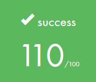

<p align="center">
  
</p>
<h3 align="center">
  <em>And thanks for all the fish!</em>
</h3>

---

## ⚠️ Disclaimer

- **Full Portfolio:** This repository focuses on this specific project. You can find my entire 42 curriculum 👉 [here](https://github.com/Overtekk/42).
- **Subject Rules:** I strictly follow the rules regarding 42 subjects; I cannot share the PDFs, but I explain the concepts in this README.
- **Archive State:** The code is preserved exactly as it was during evaluation (graded state). I do not update it, so you can see my progress and mistakes from that time.
- **Academic Integrity:** I encourage you to try the project yourself first. Use this repo only as a reference, not for copy-pasting. Be patient, you will succeed.

## 📂 Purpose

The goal of this project is to create a small 2D game where a character collects items and escapes a map. It serves as our first step into the world of **graphics programming**.

This project introduces the **MiniLibX** (MLX), a simple graphical library provided by 42. It teaches us how to open a window, render images (textures), and handle **events** like keyboard inputs (hooks) or window closing.
Beyond graphics, a significant part of the logic involves **map parsing** and validation. We must read a configuration file (`.ber`) and ensure the map is playable using algorithms like **Flood Fill** to check for valid paths.

**📊 Full Project:**
It's the first full project that we do. No moulinette. Mandatory part but with a lot of liberty at the end. The goal is to make a complete game using all our knowledge.

**📦 Library Integration:**
We are allowed to use our `libft` in this project. However, the technical challenge lies in compiling and linking the **MiniLibX** library. This requires understanding specific compilation flags and managing multiple static libraries simultaneously.

**🏆 Goal:**
Create a game where the player's goal is to collect all collectibles on the map, then escape by choosing the shortest possible route. The number of movements will be displayed either in the shell, or in the game.

## 🐨 Status

Completed on **05/12/2025** with **1/3** bonus.\
*- Add steps count on screen*
<p align="left">
  
</p>

## 🔷 Usage

### First, clone this repository.
```bash
https://github.com/Overtekk/so_long.git
```
### Compile with make
```bash
make
```
### Run the game with a valid map (.ber)
*There are multiples maps created in the folder `maps`. Inside, there is a folder with invalid maps in case you wanna test.*\
Run:
```bash
./so_long maps/map_basic.ber
```

### You can create any map you want following the rules below:
- Map the must be a .ber file.
- It can only contain these characters:

| CHARACTER | OBJECT |
| :---: | :---: |
| `1` | Wall |
| `0` | Floor |
| `P` | Player |
| `C` | Collectible |
| `E` | Exit |

- The map must be rectangular, surrounded by walls and not having an empty line.
- The map must contain only one character, one exit and a least one collectible.
- The player must be able to collect all collectibles and go to the exit.

A valid map can be:
```
111111111111
100000P00001
1000C000C001
100E0000C001
111111111111
```

An invalid map can be:
```
111111111111
100000P00001
1000C000C001
100E0000C001
100111111111
```

### Movement

| INPUT | Action |
| :---: | :---: |
| ⬆️ | `W` |
| ⬅️ | `A` |
| ⬇️ | `S` |
| ➡️ | `D` |
| Quit | 'Escape" | 

---
